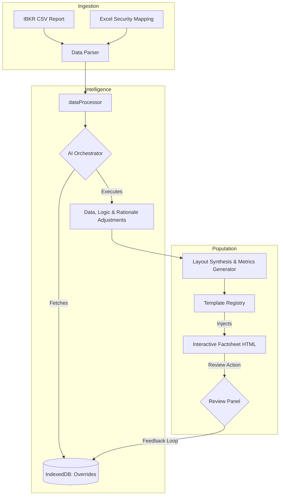

<div align="center">
  
</div>

# Cipres Analytics

A high-performance Business Intelligence Dashboard designed to transform raw operational data into professional, print-ready reports. It processes Excel mapping files and CSV position reports to generate dynamic visualizations and data-driven insights.

**Privacy-First Architecture:** The application **starts off entirely offline**, meaning all data processing and PDF-style preview generation happens locally in your browser. No sensitive financial data leaves your machine by default. Users can optionally enable advanced AI features by supplying their own API keys.

## Features

- **Automated Data Processing**: Effortlessly aggregate exposures from IBKR CSV reports using custom Excel mapping.
- **Dynamic Charting**: High-fidelity charts for Thematic Exposure, Geographical Exposure, Market Cap, and Liquidity metrics.
- **Multi-Template Support**: Dynamically handle different factsheet layouts and requirements, including custom 'Simple Summary' templates.
- **Persistent Data Layer (IndexedDB)**: 
  - **Historical Tracking**: Store previous months' returns and exposure data locally.
  - **Automatic Consolidation**: Automatically compare new monthly reports with previous data to calculate performance deltas and trends.
- **AI-Driven Data Ingestion (Optional)**:
  - Integrate carefully scoped Google Gemini AI prompts to transform unstructured inputs into structured factsheet elements.
  - Automatically summarize strategy overviews, map unknown tickers to themes, and highlight historical returns.
  - Schema-driven extraction ensures predictable JSON outputs mapped directly into factsheet templates.
- **Self-Correcting AI Dashboard (Dual-Wrapper Architecture)**:
  - **Interactive Review Panel**: Instant hover traceability into the PEDIGREE of every number (Datasource vs. Calculation vs. AI-generated). 
  - **Contextual Lineage**: Surfacing raw CSV sources and formula components within the review modal to ensure data auditability.
  - **Statistical Review (`review-type="statistic"`)**: Click on static numerical data points (e.g., monthly returns) to toggle **Direct Edit Mode**. Type manual overrides to instantly correct data via `MODIFY_DATA` actions.
  - **Logic & Rationale Review (`review-type="logic"`)**: For complex math or text commentary, click to prompt AI models (Doubao/Gemini) to rewrite rules on-the-fly via `MODIFY_LOGIC` or `MODIFY_RATIONALE` actions.

## 🌊 Workflow Architecture

The application follows a modular "Agentic Analyst" pipeline that transforms raw data into interactive, audit-ready factsheets.




## Run Locally

**Prerequisites:** Node.js (v18+)

1. **Install dependencies:**
   ```bash
   npm install
   ```
2. **Set up API Key (Optional):**
   Create a `.env.local` file and add your Gemini API key (or configuring custom endpoints within the app) for AI-enhanced features:
   ```
   VITE_GEMINI_API_KEY=your_api_key_here
   ```
3. **Run the app:**
   ```bash
   npm run dev
   ```

## 📊 Quick Start: Demo Dashboard Guide

To see the **Cipres Analytics Dashboard** in action immediately, you can use the provided demo files located in the `public/` directory.

1.  **Run the application** locally (`npm run dev`) and navigate to `http://localhost:3000`.
2.  **Select the Template**: Ensure "Business Intelligence Dashboard" is selected in the template dropdown.
3.  **Upload Mapping File**: Use the **"Upload Mapping"** button and select `public/demo_mapping.xlsx`. 
    *   *This file maps operational symbols to departments like R&D, Operations, and Infrastructure.*
4.  **Upload Operations Report**: Use the **"Upload Report"** button and select `public/demo_operations.csv`.
    *   *This file contains dummy asset values and status for various projects.*
5.  **Generate**: Click the **"Generate Insights"** button. 
6.  **Review**: Hover over the **Operational Index** or any cell in the **Historical Operating Metrics** table to see the interactive AI review tooltips!
7.  **Export**: Click **"Export Dashboard (HTML)"** to save your report.

## Usage

1.  **Step 1**: Upload your **Excel mapping file** (e.g., `Data_Preparation.xlsx` or the provided `demo_mapping.xlsx`).
2.  **Step 2**: Upload your **CSV position report** (e.g., `IBKR_Report.csv` or `demo_operations.csv`).
3.  **Step 3**: (Optional) Provide context text/PDFs for AI summarization in the "Context" area.
4.  **Step 4**: Select your preferred template (standard dashboard or simple summary).
5.  **Step 5**: View the automatically generated dashboard preview and print/save as PDF.

## 🚀 Roadmap: Dynamic AI Orchestrator Integration

- **Phase 7: AI-Generated Component Architecture**:
  - Transition from static templates to dynamic components using the "Template Triad" (Elements, DBs, Logics).
  - Implement a backend orchestration loop where the AI processes saved IndexedDB override logic and dynamically renders the UI schema.
