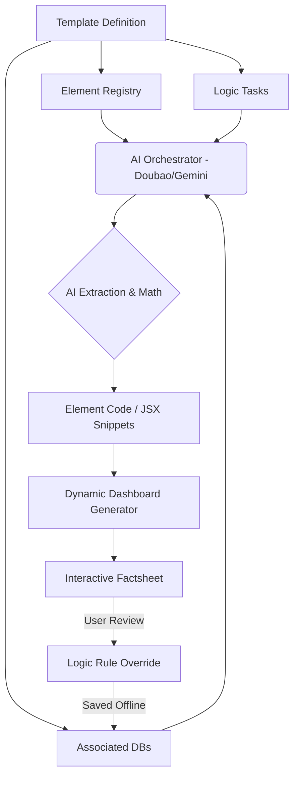
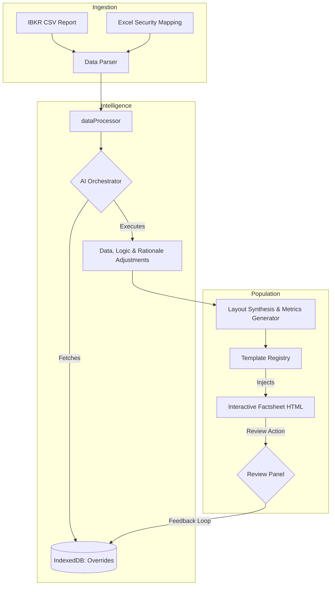
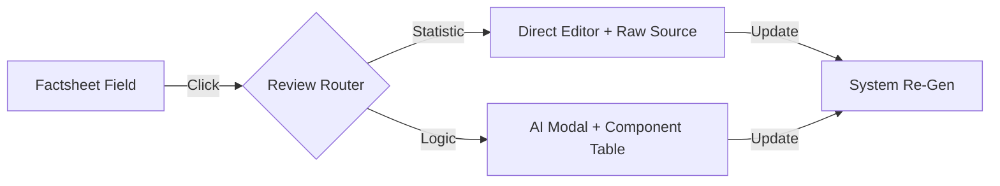

# Proposal: Automated Factsheet Calculations & AI Architecture

This proposal outlines the technical implementation for automating financial calculations and the transition to a dynamic AI-driven template system.

---

## 🚦 Implementation Status

- **Section 1: Performance Returns** 🟢 **DONE** (Implemented in `performanceMetrics.ts` & `performanceTable.ts`)
- **Section 2: Sharpe Ratio** 🟢 **DONE** (Math implemented, using configurable Risk-Free Rate)
- **Section 2: Volatility** 🟢 **DONE** (Math implemented and exposed in processor)
- **Section 3: Exposure Deltas** 🟢 **DONE** (Comparison logic with previous snapshots implemented)
- **Section 3: Market Cap Buckets** 🟢 **DONE** (Bucketing integrated in `dataProcessor`)
- **Section 4: Interactive Review & AI-Correction** 🟢 **DONE** (Hover traceability and Modal implemented)
- **Section 6 & 8: Dual-Wrapper & Statistical Review** 🟢 **DONE** (Direct edit vs AI assistant routing implemented)
- **Section 7: AI Orchestrator & Action Router** 🟢 **DONE** (Dynamic execution loop implemented)
- **Phase 12: Full Session Persistence** 🟢 **DONE** (Environment state snapshots & History panel implemented)

---

## 1. Performance Returns (Monthly & Annualized)

### Year-to-Date (YTD) [DONE]
- **Formula:** $\prod (1 + R_i) - 1$, where $R_i$ is the monthly return for month $i$ of the current year.
- **Automation:** Handled by `generatePerformanceTableHtml.ts`.
- **Reviewability:** The YTD value is wrapped in a reviewable span, allowing the user to click to verify the formula and components.

### Annualized Returns (1Y, 3Y, 5Y) [DONE]
- **Formula:** $[\prod (1 + R_i)]^{(12/n)} - 1$, where $n$ is the number of months in the period.
- **Automation:** Handled by `calculatePerformanceMetrics.ts`.

### Inception CAGR [DONE]
- **Formula:** $(\frac{V_{final}}{V_{initial}})^{(1/t)} - 1$, where $t$ is the number of years since inception.
- **Automation:** Directly computed from the NAV series.

---

## 2. Risk Metrics

### Sharpe Ratio [DONE]
- **Formula:** $\frac{R_p - R_f}{\sigma_p}$
    - $R_f$: Added a "Financial Assumptions" field in settings to define the benchmark risk-free rate.
- **Automation:** Calculated in `performanceMetrics.ts`.

### Volatility [DONE]
- **Formula:** $\text{StDev}(R_{monthly}) \times \sqrt{12}$
- **Automation:** Integrated and calculated dynamically during snapshot generation.

---

## 3. Exposure Deltas & Rebalancing [DONE]

### Automated Commentary (Top Themes)
- **Logic Improvement:** The system generates top 2 exposure deltas comparing current versus previous snapshot data.

### Market Cap & Liquidity Charts
- **Task:** Added bucketing arrays to `dataProcessor.ts` to transform and mock market cap inputs for correct generation.

---

## 4. Interactive Review & AI-Correction [DONE]

### 6. Dual-Wrapper Review Architecture
The system employs a multi-tiered review strategy by categorizing every trace element on the dashboard via a `review-type` attribute.

#### A. Statistic Wrapper (`review-type="statistic"`)
- **Target:** Static, historical, or hardcoded inputs (e.g., Monthly Returns, Inception NAV).
- **UX Action:** Clicking toggles **In-line Direct Edit Mode**.
- **Execution:** User overrides the number directly -> Generates a `MODIFY_DATA` action -> Persisted as a static truth.

#### B. Calculation Wrapper (`review-type="logic"`)
- **Target:** Derived metrics, automated commentary, or structural mappings (e.g., YTD, Sharpe, Rationale).
- **UX Action:** Clicking opens the **AI Correction Modal**.
- **Execution:** User provides instructions -> AI generates a methodology rule -> Generates a `MODIFY_LOGIC` action -> Dynamic re-calculation during generation.

### 7. Logic Correction (Review Action)
- **Workflow:** User clicks a value (`review-type="logic"`) -> Enters instruction in the `AICorrectionModal` -> AI (Doubao/Gemini) generates a "Logic Rule" -> Stores in **IndexedDB** (`overrides` store).
- **Persistence:** Future generations prioritize these rules over default math.

### 8. Statistical Data Review (In-line Editing)
- **Workflow:** For "Statistic" data points (like monthly returns in the grid), clicking doesn't just prompt an AI; it enables **Direct Edit Mode**.
- **Execution:** User types the new value -> The system generates a `MODIFY_DATA` action automatically -> Saved in IndexedDB.
- **Verification:** The dashboard and calculated metrics (like YTD) instantly re-render using the new manual statistic.

---

## 7. Phase 7: AI-Generated Component Architecture [DONE]

The system now utilizes a modular architecture where template data is dynamically corrected by an AI orchestrator based on a triad of inputs.

### The Template Triad
1. **Elements**: A library of UI component definitions (e.g., PerformanceChart, ExposureMap).
2. **Databases**: Local snapshots, CSV mappings, and historical performance tables.
3. **Logics (Tasks)**: Natural language descriptions of the processing requirements (e.g., *"Generate a table comparing Top 5 holdings vs. previous month's weights"*).

### AI Workflow structure

### Description
In this architecture, the **AI Orchestrator** receives the full context of what needs to be displayed (Elements), the data available (Databases), and the specific business rules (Logics). The AI then performs the "Task" and produces the **Element Code**. This code isn't just a string, but a structured definition that tells the Dashboard Generator how to render the final interactive components.

### AI Operational Actions (Action Router)
To support the AI reacting to prompts (both general text prompts and specific click-to-review prompts), the Orchestrator utilizes an **Action Router**. When prompted, the AI classifies the intent and outputs a structured action to modify the application state:

1. \`MODIFY_DATA\`: Direct overwrite of a static, historical, or mapped value.
   - *Example*: User says, "Change the November 2024 return from 1.5% to 2.1%".
   - *Implementation*: AI emits \`{ action: 'MODIFY_DATA', entity: 'monthlyReturns', params: { year: 2024, month: 'Nov', newValue: '2.1%' } }\`. The frontend commits this to IndexedDB, allowing static DB modification without code changes.
2. \`MODIFY_LOGIC\`: Altering the underlying mathematical formula or structural mapping rule.
   - *Example*: User says, "The Sharpe ratio should use a 2% compound risk-free rate."
   - *Implementation*: AI emits \`{ action: 'MODIFY_LOGIC', fieldId: 'sharpe_ratio', newLogic: '...' }\`. The system saves this overriding business rule to the \`overrides\` store for future processing.
3. \`MODIFY_RATIONALE\`: Rewriting textual commentary, strategy descriptions, or logic details.
   - *Example*: User says, "Expand the rationale for Clean Energy to mention solar tariffs."
   - *Implementation*: AI emits \`{ action: 'MODIFY_RATIONALE', target: 'clean_energy_commentary', newText: '...' }\`. The AI returns the rewritten rationale for immediate injection into the factsheet payload.

---

## 8. System Flow: Ingestion & Template Population

The following diagram illustrates the end-to-end journey of data from raw files through AI-orchestration and final template rendering.

---

## 9. Lineage-Aware Review Interface

To maximize trust and accuracy, the Review System (both Statistic and Logic) will surface a "Contextual Lineage" section within the review modals. This ensures the user is not editing in a vacuum.

### A. Statistic Context (Fact Traceability)
- **Visual**: A "Source Record" card at the bottom of the `StatisticEditModal`.
- **Data**: Displays the raw CSV row, filename, and original cell value from which the statistic was parsed.
- **Rationale**: Gives the user confidence that they are correcting a parsing error or an upstream data issue.

### B. Logic Context (Component Breakdown)
- **Visual**: A "Related Values" table at the bottom of the `AICorrectionModal`.
- **Data**: Lists the specific dependency fields used to compute the metric.
    - *Example (YTD)*: Shows the individual monthly returns for the current year.
    - *Example (Sharpe)*: Shows the Annualized Return, Volatility, and Risk-Free Rate used.
- **Rationale**: Helps the user distinguish between "The math is wrong" (Logic update needed) vs "One of the inputs is wrong" (Statistic update needed).

### Review-Context Workflow

---

## 12. Phase 12: Full Session Persistence & Historical Retrieval [PROPOSED]

To achieve "Infinite Auditability," the system will transition from simple output snapshots to full **Session State Persistence**. This enables a "Time Travel" feature where any previous factsheet generation environment can be perfectly reconstructed.

### A. The Session Model
Unlike a snapshot (which only stores results), a **Session** encapsulates the entire application state:
- **Raw Inputs**: The original XLSX JSON (Mapping/Report) and performance text.
- **Custom Overrides**: All manual edits made in the "Data" tab.
- **Template State**: The specific template ID and parameters used.
- **Audit Metadata**: Calculation processes and AI insights at that point in time.

### B. History & Restoration Workflow
1. **Capture**: Every time a factsheet is "Generated" or "Published", a full session object is saved to a new `sessions` store in IndexedDB.
2. **Browse**: A new **History Page** lists these sessions by report date and creation timestamp.
3. **Restore**: Clicking "Load" on a historical session performs a **State Swap**. The current mapping, report, and custom data are replaced with the historical versions, allowing the user to precisely re-generate or edit an old report.

### C. Cross-Session Consistency
While data and inputs are session-locked, **Logic Overrides** (AI rules) remain **Global**. This ensures that if a user corrects a compound interest formula today, that correction is automatically applied if they choose to re-generate a report from six months ago.

---

> [!NOTE]
> This proposal (v0.16) moves the application from "Point-in-Time Generation" to a "Relational Factsheet Database," making the entire factsheet history interactive and reversible.
